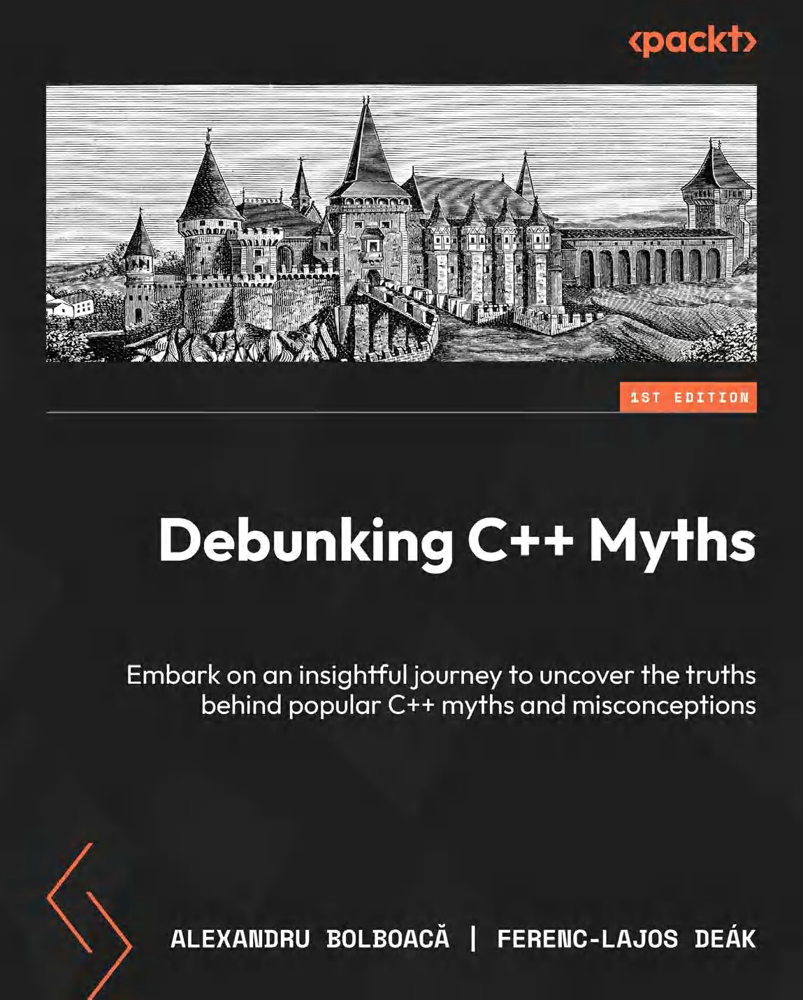

# 走出C++谜云

*揭开C++的真相与误解*

* 作者：Alexandru Bolboacă，Ferenc-Lajos Deák
* 译者：陈晓伟
* 出版于: 2024年12月

> [!IMPORTANT]
> 翻译是译者用自己的思想，换一种语言，对原作者想法的重新阐释。鉴于我的学识所限，误解和错译在所难免。如果你能买到本书的原版，且有能力阅读英文，请直接去读原文。因为与之相较，我的译文可能根本不值得一读。
>
> — 云风，程序员修炼之道第2版译者

> [!NOTE]
> 译版在Release中提供生成好的PDF文件以供下载，若需要其他格式请自行安装第三方工具(比如：Calibre)进行转换

> [!TIP]
> 译文的LaTeX 环境配置：https://www.cnblogs.com/1625--H/p/11524968.html
>
>  * 禁用拼写检查：https://blog.csdn.net/weixin_39278265/article/details/87931348
>
>  * 使用xelatex编译时需要添加`-shell-escape`和`-8bit`选项，例如：
>
>    `xelatex -synctex=1 -interaction=nonstopmode -shell-escape -8bit "book".tex`
>
>  * 为了内容中表格和目录索引能正常生成，至少需要连续编译两次
>
>  * Latex中的中文字体([思源宋体](https://github.com/notofonts/noto-cjk/releases))和英文字体([Hack](https://github.com/source-foundry/Hack-windows-installer/releases/tag/v1.6.0))，需要安装后自行配置。如何配置请参考主book/css.tex顶部关于字体的信息。
>
> vscode中配置LaTeX：https://blog.csdn.net/Ruins_LEE/article/details/123555016

## 本书概述

深入探究C++常见迷思的起源及其当代意义，规避典型陷阱，并采用现代最佳实践，以驾驭不断演进的C++编程格局。

**关于本书**

你以为自己了解C++？是时候重新审视了。

数十年来，C++始终笼罩在种种迷思与误解之中 --- 从早期的设计决策到至今仍在流传的认知偏差。"C++学习曲线过于陡峭"或"C++已经过时"等论调或许有其历史根源，却全然忽视了这门语言持续的进化与现代特性。

本书由拥有40余年行业实战经验的专家团队执笔，系统解构这些迷思的起源，并置于当代C++语境下重新审视。通过深入剖析高级特性与最佳实践，助您全面提升项目质量。每一章聚焦一个具体误区，重点解读智能指针、lambda表达式和并发机制等现代特性，同时提供可落地的实战策略：无论是处理代码可移植性、编译器兼容性等经典难题，还是将现代最佳实践融入现有代码库以优化性能并确保长期可维护性。

阅读本书后，您将全面掌握C++的演进脉络，从而能够做出明智的技术决策，充分发挥其强大特性，最终实现个人技能、编码实践与项目质量的全面提升。

**主要特点**

* 追溯C++常见误解的起源，解析其长期存在的深层原因
* 掌握规避因误读C++标准而导致陷阱的方法
* 发掘并善用C++编程语言中被低估的隐藏特性

**内容包括**

* 深入理解C++发展历程及影响现代编程的关键设计决策
* 掌握程序流程控制的核心原理，构建高效调试方法论
* 从容应对跨编译器与跨平台的兼容性挑战
* 精准识别潜在风险，规避可能引发未定义行为的代码实现
* 探索学术教材中鲜少涉及的C++高阶特性
* 解析编译器代码生成与优化机制的技术本质
* 领悟未定义行为保持"未定义"的深层设计哲学

**适读人群**

本书适合中高级C++开发者深入探索语言精妙之处。无论是渴望规避常见错误的程序员、富有幽默感的极客学者，还是任何对C++感兴趣的开发者，都将从中获益。想要拓展知识边界、精进既有技能、探索新范式或钻研C++微妙之处的编程人员，均可在此获得珍贵洞见。此外，正在采用新技术或探索C++生态系统的技术主管和软件工程经理，也将从本书中收获良多。

## 作者简介

[Alex Bolboaca](https://www.amazon.com/stores/author/B07VGJ5RND/about?ingress=0&visitId=3681fba3-55d3-4740-bd35-8040d21f011d&ref_=ap_rdr)1977年出生于罗马尼亚特兰西瓦尼亚的神秘土地，恰逢《星球大战》上映之年。十岁时他阅读了人生第一本计算机书籍，从此对这个迷人领域产生浓厚兴趣，并投身软件开发这一新兴行业。值得庆幸的是，随着1989年罗马尼亚革命爆发，阻碍他职业发展的主要障碍被扫除，亚历克斯得以自由追逐理想。

[Ferenc Deák](https://www.amazon.com/stores/author/B0DT724DDC/about?ingress=0&visitId=1d5aad24-db29-468e-aa25-2626037f0f87&ref_=ap_rdr)是一位拥有15年以上经验的软件开发者，专精于系统编程、软件安全与应用设计领域。现居挪威特隆赫姆的他，曾参与开发自动驾驶系统、实时交通解决方案及密码学应用程序等多个项目。

## 本书相关

* Github翻译地址：https://github.com/xiaoweiChen/Debunking-Cpp-Myths

